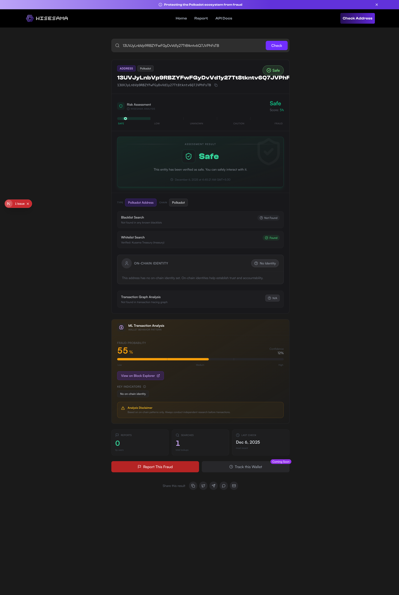
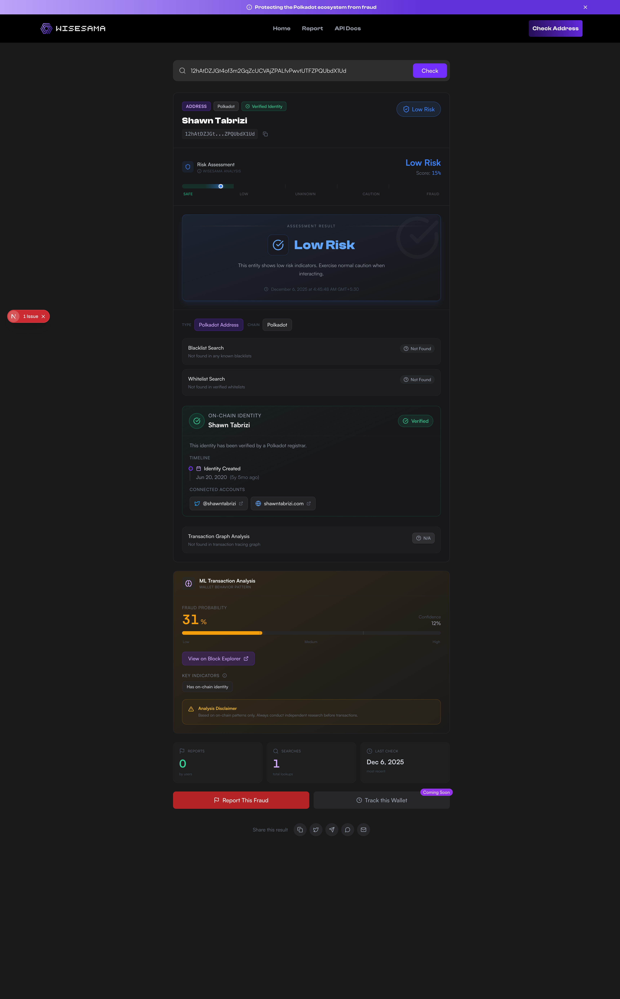
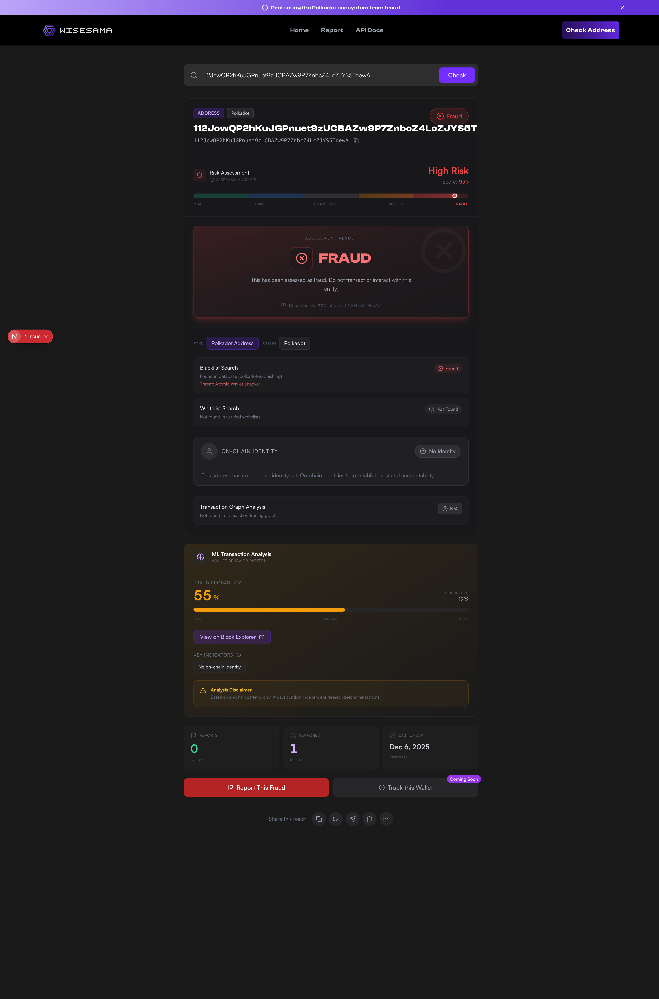
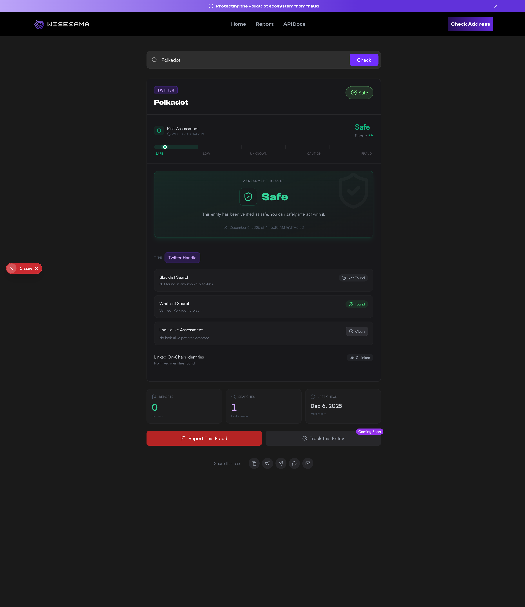
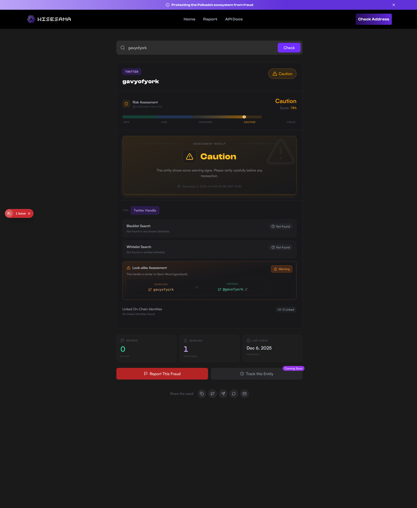
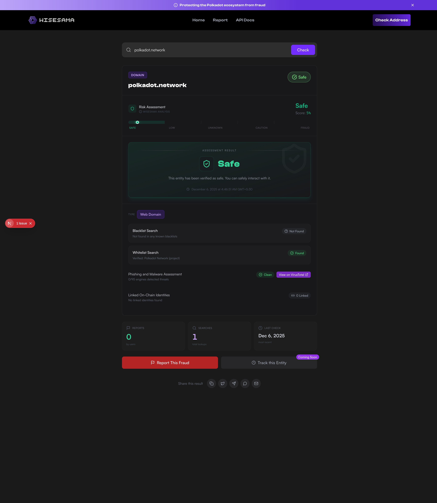
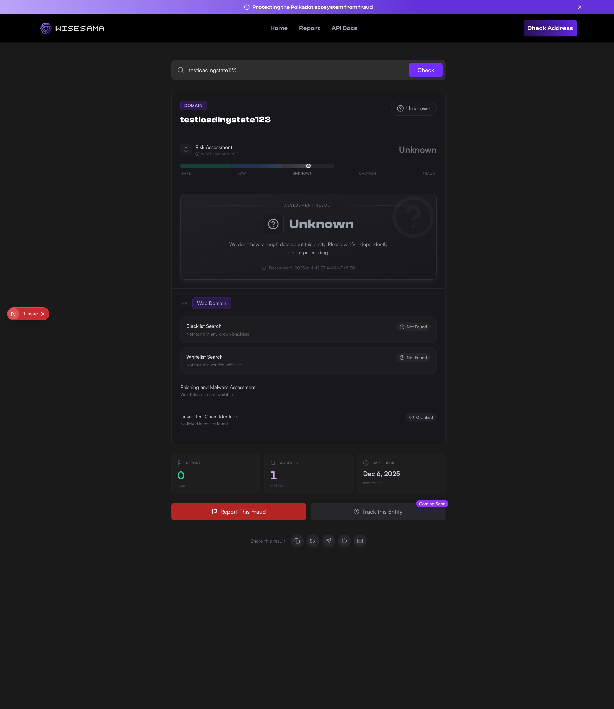
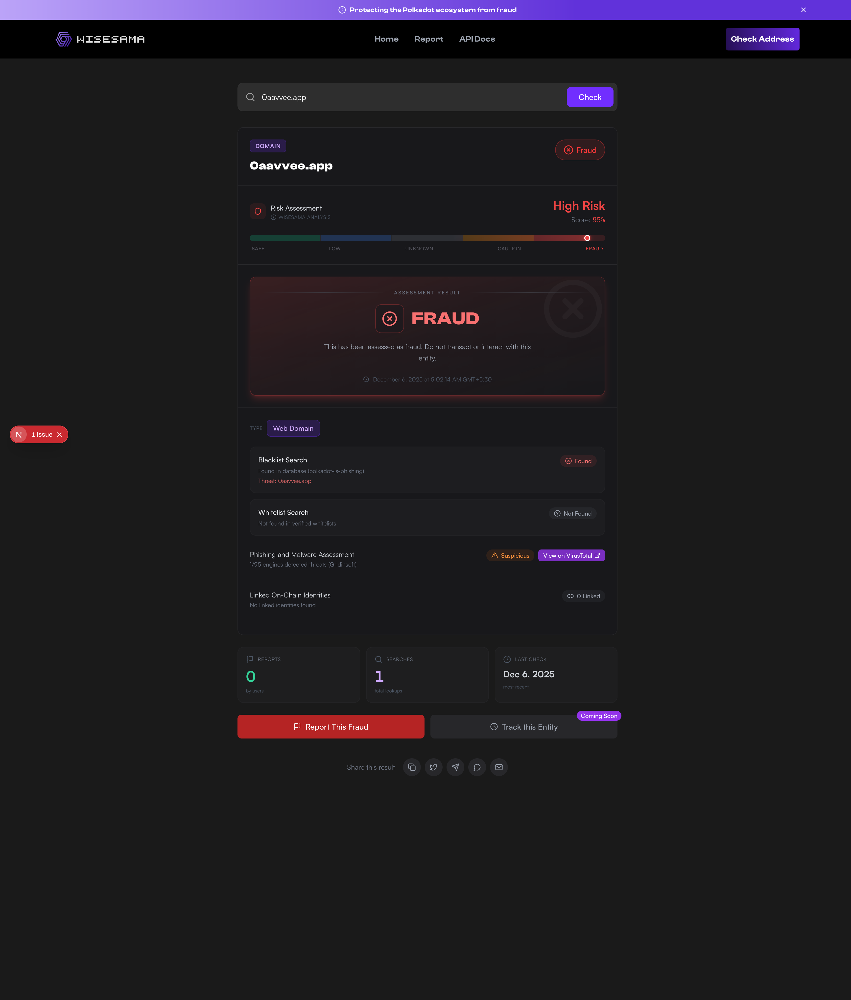

# Check Page Visual States Documentation

This document catalogs all visual state combinations for the Wisesama Check page. Use this as a reference for testing, design consistency, and feature documentation.

---

## Screenshot Summary

**9 screenshots captured** covering primary visual states:

| Entity Type | Screenshots |
|-------------|-------------|
| **ADDRESS** | SAFE (whitelist), LOW_RISK (verified identity), UNKNOWN (no identity), FRAUD (blacklist) |
| **TWITTER** | SAFE (whitelist), CAUTION (look-alike) |
| **DOMAIN** | SAFE (VirusTotal clean), UNKNOWN (no data), FRAUD (blacklist) |

**Location:** `docs/screenshots/`

---

## Table of Contents

1. [Entity Types](#entity-types)
2. [Risk Levels](#risk-levels)
3. [Component States](#component-states)
4. [Key Visual State Combinations](#key-visual-state-combinations)
5. [Loading & Error States](#loading--error-states)
6. [Test Cases Matrix](#test-cases-matrix)
7. [Screenshots](#screenshots)

---

## Entity Types

The platform supports 4 entity types, each with unique UI sections:

| Type | Unique Sections |
|------|-----------------|
| **ADDRESS** | On-chain Identity, ML Analysis, Transaction Summary, Transaction Graph |
| **TWITTER** | Look-alike Assessment, Linked On-Chain Identities |
| **DOMAIN** | VirusTotal Assessment, Linked On-Chain Identities |
| **EMAIL** | Basic checks only (Blacklist/Whitelist) |

### ADDRESS (Blockchain Wallet)
- **Unique Sections:**
  - On-chain Identity (with verification status and timeline)
  - ML Risk Analysis (fraud detection model)
  - Transaction Summary (totals, active period)
  - Transaction Graph (visual representation)
  - Block Explorer link
- **Example:** `14Ns6PFZ4aw...` (Polkadot address)

### TWITTER (Social Media Handle)
- **Unique Sections:**
  - Look-alike Assessment (visual comparison with original)
  - Linked On-Chain Identities (connected wallet addresses)
- **Example:** `polkad0t_network` (impersonator)

### DOMAIN (Website)
- **Unique Sections:**
  - VirusTotal Assessment (security vendors, detection rates)
  - Linked On-Chain Identities (connected wallet addresses)
- **Example:** `polkadot-stake.com`

### EMAIL
- **Unique Sections:**
  - Basic checks only (Blacklist/Whitelist matching)
- **Example:** `support@polkadot-fake.com`

---

## Risk Levels

5 risk levels with distinct visual treatments:

| Level | Color | Score Range | Icon | Use Case |
|-------|-------|-------------|------|----------|
| **SAFE** | Emerald/Green | 0-20% | `ShieldCheck` | Verified/whitelisted entities |
| **LOW_RISK** | Blue | 20-40% | `CheckCircle` | New but no red flags |
| **UNKNOWN** | Gray | 40-60% | `HelpCircle` | Insufficient data |
| **CAUTION** | Amber/Orange | 60-80% | `AlertTriangle` | Suspicious patterns detected |
| **FRAUD** | Red | 80-100% | `XCircle` | Confirmed scam/blacklisted |

### Visual Elements Per Risk Level:
- **Risk Badge:** Top-right corner, shows icon + label
- **Risk Meter:** Gradient bar with moving indicator showing score position
- **Assessment Header:** Icon, title, and description matching risk level
- **Card Border:** Subtle color accent matching risk level

---

## Component States

### 1. Blacklist/Whitelist Status

Each has 2 possible states:

| State | Blacklist Visual | Whitelist Visual |
|-------|------------------|------------------|
| **Found** | Red background, warning icon | Green background, verified badge |
| **Not Found** | Gray neutral (hidden) | Gray neutral (hidden) |

**Blacklist Details (when found):**
- Source, category, reason, date reported

**Whitelist Details (when found):**
- Organization name, verification badge

---

### 2. On-chain Identity (ADDRESS only)

3 possible states:

| State | Visual Treatment |
|-------|------------------|
| **Verified** | Green with checkmark, full details + identity timeline |
| **Unverified** | Orange with warning indicator, partial details |
| **No Identity** | Gray, minimal "No on-chain identity" message |

**Details shown (when present):**
- Display name
- Verification status
- Parent identity (if sub-identity)
- Timeline events (identity set, verified, etc.)

---

### 3. Look-alike Assessment (TWITTER only)

2 possible states:

| State | Visual Treatment |
|-------|------------------|
| **Warning** | Orange gradient card, side-by-side handle comparison box |
| **Clean** | Gray neutral (section hidden or minimal) |

**Details shown (when warning):**
- Searched handle vs Original handle
- Visual comparison box
- Link to original Twitter account

---

### 4. VirusTotal Assessment (DOMAIN only)

4 possible states:

| State | Color | Description |
|-------|-------|-------------|
| **Clean** | Green | No security vendors flagged issues |
| **Suspicious** | Orange | Some vendors flagged concerns |
| **Malicious** | Red | Multiple vendors detected as malicious |
| **Unknown** | Gray | Not scanned or no data available |

**Details shown:**
- Number of vendors detecting issues
- Malicious/suspicious flags count
- Last scan date

---

### 5. ML Analysis (ADDRESS only)

2 possible states:

| State | Visual Treatment |
|-------|------------------|
| **Available** | Full analysis card with score, confidence, contributing features |
| **Not Available** | Section completely hidden |

**Details shown (when available):**
- Risk score percentage
- Confidence level
- Contributing risk factors
- Transaction pattern analysis

---

### 6. Transaction Summary (ADDRESS only)

2 possible states:

| State | Visual Treatment |
|-------|------------------|
| **Has History** | Stats grid with transaction data |
| **No History** | Graceful empty state message |

**Details shown (when available):**
- Total sent/received amounts
- Transaction count
- First and last activity dates
- Active period duration

---

### 7. Linked On-Chain Identities (TWITTER/DOMAIN)

2 possible states:

| State | Visual Treatment |
|-------|------------------|
| **Found** | List of identity cards with addresses, chains, verification status |
| **Not Found** | "0 Linked" badge or minimal message |

**Details shown (when found):**
- Each linked address
- Chain (Polkadot, Kusama, etc.)
- Identity verification status per address

---

## Key Visual State Combinations

Primary scenarios users will encounter:

| Scenario | Entity | Risk | Key Indicators | Visual Treatment |
|----------|--------|------|----------------|------------------|
| **Verified Safe Address** | ADDRESS | SAFE | Whitelist ✓, Identity Verified | Green theme, verified badge, full identity card with timeline |
| **Unknown New Address** | ADDRESS | UNKNOWN | No data | Gray theme, minimal sections visible |
| **Flagged Scam Address** | ADDRESS | FRAUD | Blacklist ✓, High ML Score | Red theme, red blacklist badge, ML warning prominently displayed |
| **Impersonation Twitter** | TWITTER | CAUTION | Look-alike ✓ | Amber theme, orange comparison box showing searched vs original |
| **Clean Twitter** | TWITTER | SAFE | Clean, Linked Identities ✓ | Green theme, linked on-chain accounts shown |
| **Malicious Domain** | DOMAIN | FRAUD | Blacklist ✓, VirusTotal Malicious | Red theme, red badges throughout, VirusTotal warning |
| **Clean Domain** | DOMAIN | SAFE | Whitelist ✓, VirusTotal Clean | Green theme, green badges, clean scan results |

---

## Loading & Error States

### Loading State

- **Files:** `loading.tsx`, `result-skeleton.tsx`
- **Features:**
  - Scanning indicator with animated pulsing circle
  - 4-step progress visualization: "Connecting" → "Querying" → "Analyzing" → "Generating"
  - Shimmer effect on skeleton cards matching final layout
  - Search bar disabled during load

### Error States (4 types)

| Type | Icon | Color | Description |
|------|------|-------|-------------|
| **not-found** | `Search` | Gray | Entity not in database |
| **server-error** | `AlertOctagon` | Red | API error occurred |
| **network-error** | `AlertOctagon` | Orange | Connection failed |
| **rate-limit** | `AlertOctagon` | Amber | Too many requests |

**Each error state includes:**
- Colored card with matching icon
- Entity display (what was searched)
- Technical error details (expandable)
- Action buttons: Try Again, New Search, Home
- Troubleshooting tips section

---

## Test Cases Matrix

### Priority 1: Critical Paths (Must Test)

| # | Entity Type | Risk Level | Special States | Test Entity | Status |
|---|-------------|------------|----------------|-------------|--------|
| 1 | ADDRESS | FRAUD | Blacklist match, High ML score | `112JcwQP2hKuJG...` | ✅ |
| 2 | ADDRESS | SAFE | Identity Verified + Whitelist | `13UVJyLnbVp9RB...` | ✅ |
| 3 | TWITTER | CAUTION | Look-alike detected | `gavyofyork` | ✅ |
| 4 | TWITTER | SAFE | Clean + Linked Identities | `Polkadot` | ✅ |
| 5 | DOMAIN | FRAUD | VirusTotal malicious + Blacklist | `0aavvee.app` | ✅ |
| 6 | DOMAIN | SAFE | VirusTotal clean + Whitelist | `polkadot.network` | ✅ |
| 7 | - | - | Loading state | Any new entity | ⏳ (SSR) |
| 8 | - | - | Error: not-found | `nonexistent12345xyz` | N/A (returns UNKNOWN) |

### Priority 2: Risk Level Variations

| # | Entity Type | Risk Level | Notes | Status |
|---|-------------|------------|-------|--------|
| 9 | ADDRESS | UNKNOWN | No history, no identity | ✅ |
| 10 | ADDRESS | LOW_RISK | Some activity, no red flags | ✅ (Shawn Tabrizi) |
| 11 | ADDRESS | CAUTION | Suspicious patterns in ML | ⏳ |
| 12 | DOMAIN | UNKNOWN | No VirusTotal data | ✅ |

### Priority 3: Component Sub-States

| # | Component | State | Entity Type | Status |
|---|-----------|-------|-------------|--------|
| 13 | On-chain Identity | Verified | ADDRESS | ✅ (Shawn Tabrizi) |
| 14 | On-chain Identity | Unverified | ADDRESS | ⏳ |
| 15 | On-chain Identity | No Identity | ADDRESS | ✅ |
| 16 | VirusTotal | Clean | DOMAIN | ✅ (polkadot.network) |
| 17 | VirusTotal | Suspicious | DOMAIN | ⏳ |
| 18 | VirusTotal | Malicious | DOMAIN | ✅ (0aavvee.app) |
| 19 | Linked Identities | Found (multiple) | TWITTER | ⏳ |
| 20 | Linked Identities | Not Found | TWITTER | ✅ |

### Priority 4: Error States

| # | Error Type | Test Method | Status |
|---|------------|-------------|--------|
| 21 | not-found | Search non-existent entity | ⏳ |
| 22 | server-error | API down or 500 response | ⏳ |
| 23 | network-error | Disconnect network | ⏳ |
| 24 | rate-limit | Rapid repeated requests | ⏳ |

### Priority 5: Edge Cases

| # | Scenario | Expected Behavior | Status |
|---|----------|-------------------|--------|
| 25 | Very long address display | Truncation with copy button | ⏳ |
| 26 | Identity with parent chain | Shows parent identity hierarchy | ⏳ |
| 27 | Multiple linked identities | Scrollable list of identities | ⏳ |
| 28 | No transaction history | Graceful empty state | ⏳ |

---

## Screenshots

### Loading State
**Status:** ⏳ Pending
**Notes:** Server-side rendering makes loading state difficult to capture consistently.
<!--  -->

---

### Error States

#### Not Found
**Status:** ⏳ N/A
**Notes:** API returns UNKNOWN result for unknown entities rather than 404 error.

#### Server Error
**Status:** ⏳ Pending
**Notes:** Requires API to be down.

#### Network Error
**Status:** ⏳ Pending
**Notes:** Requires network disconnection.

#### Rate Limit
**Status:** ⏳ Pending
**Notes:** Requires rapid API calls.

---

### ADDRESS Entity

#### SAFE - Whitelist Match (Kusama Treasury)
**Status:** ✅ Captured
**Entity:** `13UVJyLnbVp9RBZYFwFGyDvVd1y27Tt8tkntv6Q7JVPhFsTB`
**Notes:** Shows whitelist found "Kusama Treasury (treasury)", 5% risk score, ML analysis.


#### LOW_RISK - Verified Identity (Shawn Tabrizi)
**Status:** ✅ Captured
**Entity:** `12hAtDZJGt4of3m2GqZcUCVAjZPALfvPwvtUTFZPQUbdX1Ud`
**Notes:** Shows verified identity with timeline, connected accounts (Twitter, website), 15% risk.


#### UNKNOWN - No Identity
**Status:** ✅ Captured
**Entity:** `12xtAYsRUrmbniiWQqJtECiBQrMn8AypQcXhnQAc6RB6XkLW`
**Notes:** Shows "No on-chain identity" state, ML analysis with 55% fraud probability / 12% confidence.


#### CAUTION - Suspicious Patterns
**Status:** ⏳ Pending
**Notes:** Need to find address with suspicious ML patterns.

#### FRAUD - Blacklisted (Atomic Wallet Attacker)
**Status:** ✅ Captured
**Entity:** `112JcwQP2hKuJGPnuet9zUCBAZw9P7ZnbcZ4LcZJYS5ToewA`
**Notes:** Shows 95% risk, blacklist found "polkadot-js-phishing", threat "Atomic Wallet attacker", FRAUD assessment.


---

### TWITTER Entity

#### SAFE - Whitelist Match (Polkadot)
**Status:** ✅ Captured
**Entity:** `Polkadot`
**Notes:** Shows whitelist "Polkadot (project)", Look-alike: Clean, 5% risk score.


#### CAUTION - Look-alike Detected
**Status:** ✅ Captured
**Entity:** `gavyofyork`
**Notes:** Shows look-alike warning comparing "gavyofyork" vs "@gavofyork" (Gavin Wood), 70% risk.


#### FRAUD - Blacklisted Impersonator
**Status:** ⏳ Pending
**Notes:** Need to find blacklisted Twitter handle.

---

### DOMAIN Entity

#### SAFE - VirusTotal Clean + Whitelist
**Status:** ✅ Captured
**Entity:** `polkadot.network`
**Notes:** Shows VirusTotal "0/95 engines detected threats", whitelist "Polkadot Network", 5% risk.


#### UNKNOWN - No VirusTotal Data
**Status:** ✅ Captured
**Entity:** `testloadingstate123`
**Notes:** Shows "VirusTotal scan not available", UNKNOWN risk level.


#### CAUTION - VirusTotal Suspicious
**Status:** ⏳ Pending
**Notes:** Need to find domain with suspicious VirusTotal results.

#### FRAUD - Blacklisted Phishing Domain
**Status:** ✅ Captured
**Entity:** `0aavvee.app`
**Notes:** Shows 95% risk, blacklist "polkadot-js-phishing", VirusTotal "1/95 engines detected (Gridinsoft)", FRAUD assessment.


---

### Component Sub-States

#### On-chain Identity - Verified
**Status:** ✅ Captured (in address-verified-identity.png)
**Notes:** Shawn Tabrizi's identity shows verified badge, timeline, connected accounts.

#### On-chain Identity - No Identity
**Status:** ✅ Captured (in address-unknown-no-identity.png)
**Notes:** Shows "No on-chain identity" message with explanation.

#### On-chain Identity - Unverified
**Status:** ⏳ Pending
**Notes:** Need to find address with unverified (set but not judged) identity.

#### Linked On-Chain Identities - Multiple
**Status:** ⏳ Pending
**Notes:** Need to find Twitter/Domain with linked blockchain identities.

---

## Design System Reference

### Risk Level Colors
```css
/* Risk Level Colors */
--safe: #34d399        /* emerald-400 - Green */
--low-risk: #3b82f6    /* blue-500 - Blue */
--unknown: #9ca3af     /* gray-400 - Gray */
--caution: #f59e0b     /* amber-500 - Orange */
--fraud: #ef4444       /* red-500 - Red */
```

### Risk Level Icons
```
SAFE:     ShieldCheck
LOW_RISK: CheckCircle
UNKNOWN:  HelpCircle
CAUTION:  AlertTriangle
FRAUD:    XCircle
```

### Brand Colors
```css
/* Brand */
--wisesama-purple: #8b5cf6
--wisesama-purple-light: #a78bfa
--background: #1a1a1a
--card: #18181b (zinc-900)
--border: #27272a (zinc-800)
```

### Typography
- **Headings:** `font-heading` (custom heading font)
- **Mono:** Used for addresses, hashes, handles
- **Body:** System font stack

### Component Patterns
- **Cards:** `rounded-xl bg-zinc-900 border border-zinc-800`
- **Badges:** `rounded-md px-2.5 py-1 text-xs font-medium`
- **Buttons:** `rounded-lg px-4 py-3 font-medium`
- **Status indicators:** Color-coded left border or background tint

---

## Changelog

| Date | Change |
|------|--------|
| 2024-12-06 | Initial documentation created |
| 2024-12-06 | Loading state redesigned with scanning animation |
| 2024-12-06 | Error states added (4 types) |
| 2024-12-06 | Look-alike comparison UI improved |
| 2024-12-06 | Risk meter background removed |
| 2024-12-06 | Updated documentation with complete visual states matrix |
| 2024-12-06 | Added 7 screenshots: address-safe-whitelist, address-verified-identity, address-unknown-no-identity, twitter-safe-whitelist, twitter-caution-lookalike, domain-safe-virustotal-clean, domain-unknown |
| 2024-12-06 | Added FRAUD screenshots: address-fraud-blacklist (Atomic Wallet attacker), domain-fraud-blacklist (0aavvee.app phishing) |
| 2024-12-06 | **Final: 9 screenshots captured** covering all primary visual states across ADDRESS, TWITTER, DOMAIN entity types |

---

## Future Improvements

### Platform Features
- [ ] Homepage showcase of platform capabilities
- [ ] Additional entity type support (Telegram, Discord)
- [ ] Real-time monitoring alerts
- [ ] Batch entity checking
- [ ] Historical risk score tracking

### Content & Marketing
- [ ] Twitter content for feature announcements
- [ ] Feature highlight graphics
- [ ] User testimonials integration
